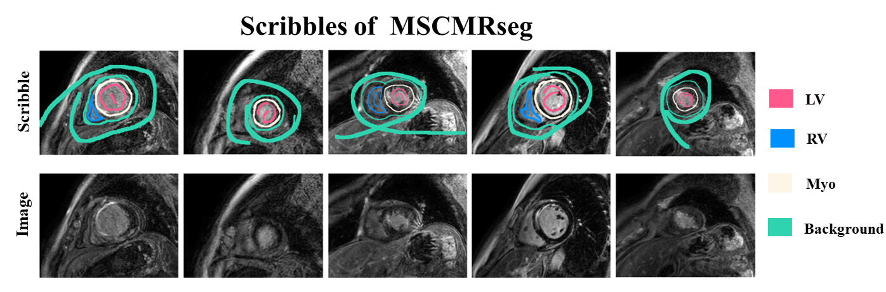
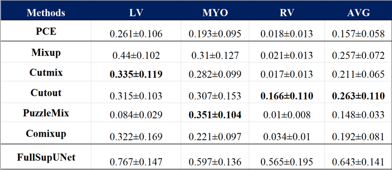

# Data Augmentation-driven Few-shot Scribble Supervised Medical Image Segmentation
This is the final project of JHU EN.520.612 Machine Learning for Signal Processing course.

## Introduction
Data Augmentation-driven Few-shot Scribble Supervised Medical Image Segmentation.

## Methods
* Dataset: The MS-CMRSeg 2019 Challenge, LGE modality from 45 cardiomyopathy patients.
* Augmentation: Mixup, Cutmix, Cutout, PuzzleMix, Comixup.
* Setup: U-Net.
* Evaluation: Dice Score.

## Results
Visualization of scribble:

Dice score performance on MSCMRseg dataset:

Visualization of segmentation:

